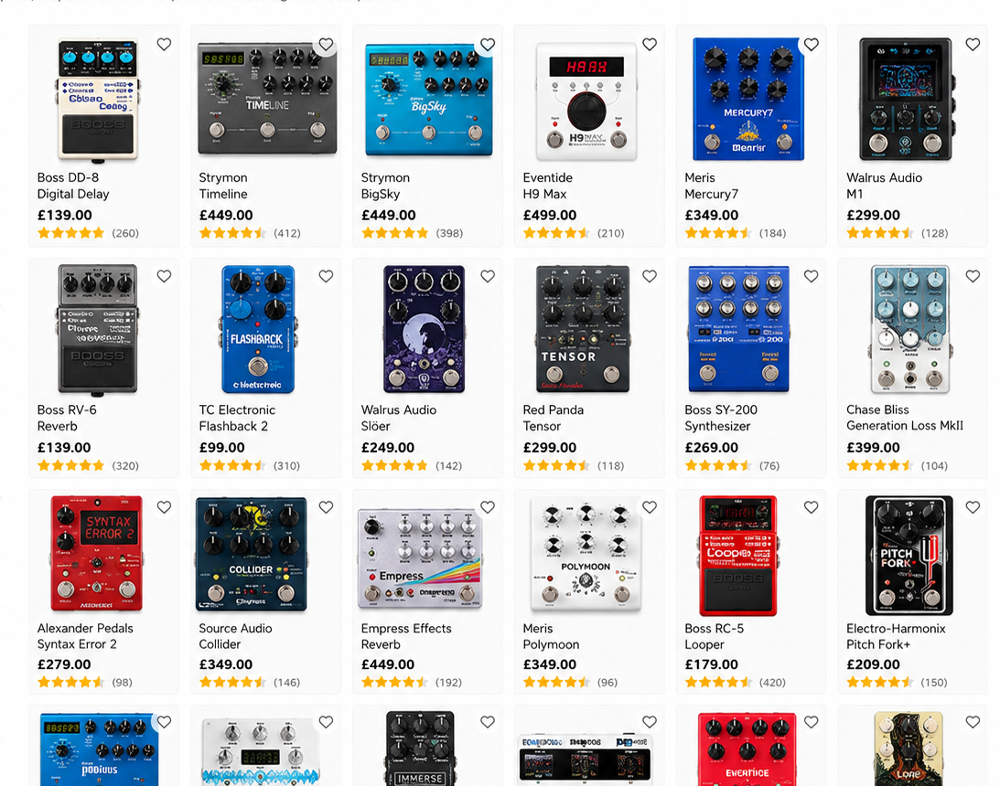
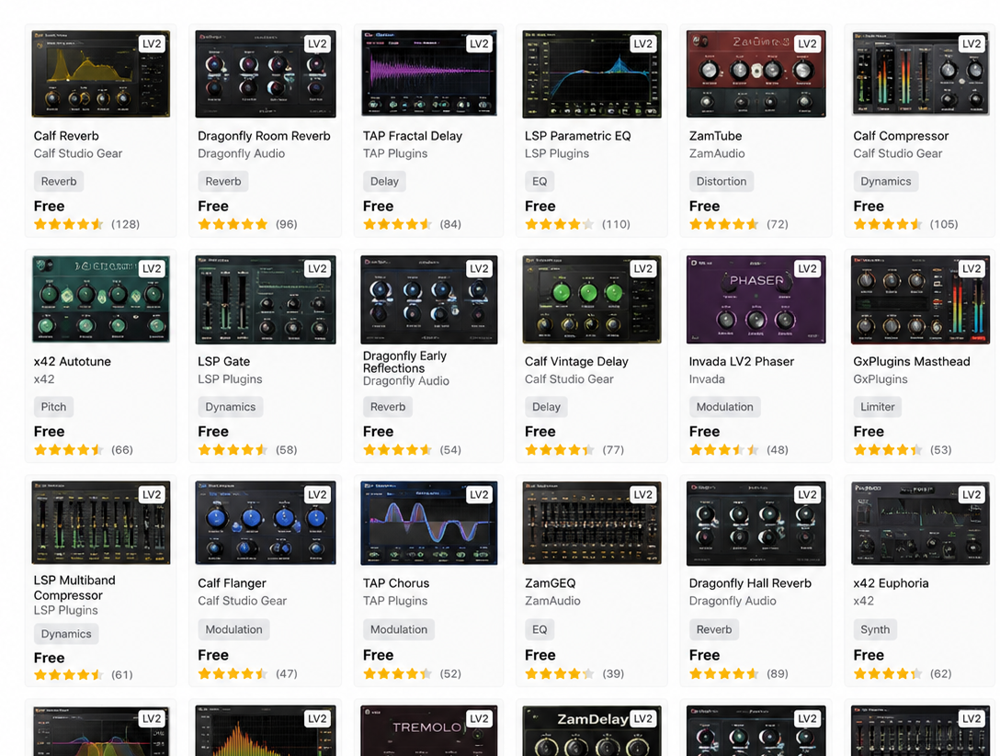
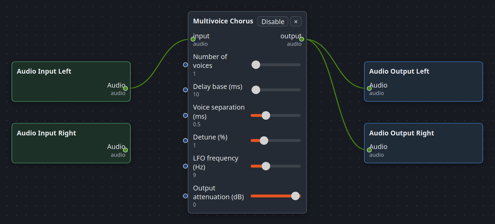
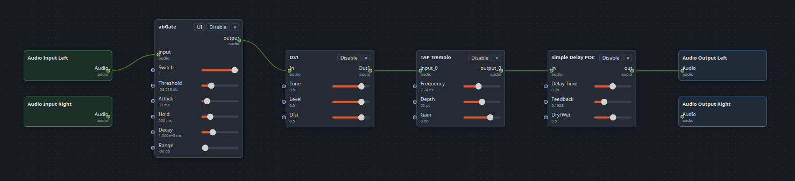
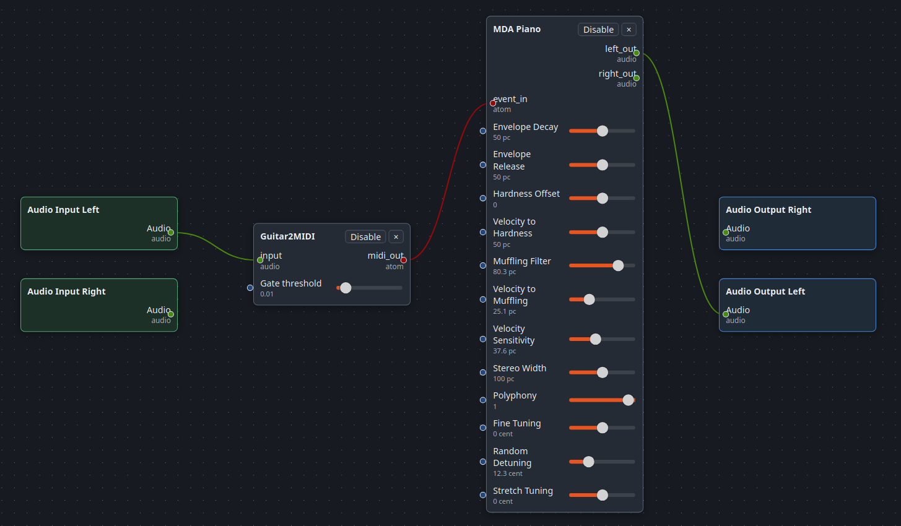
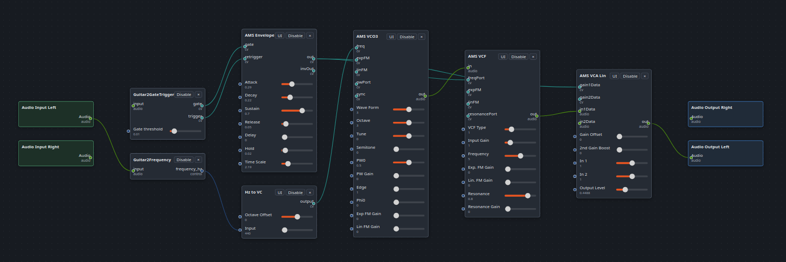
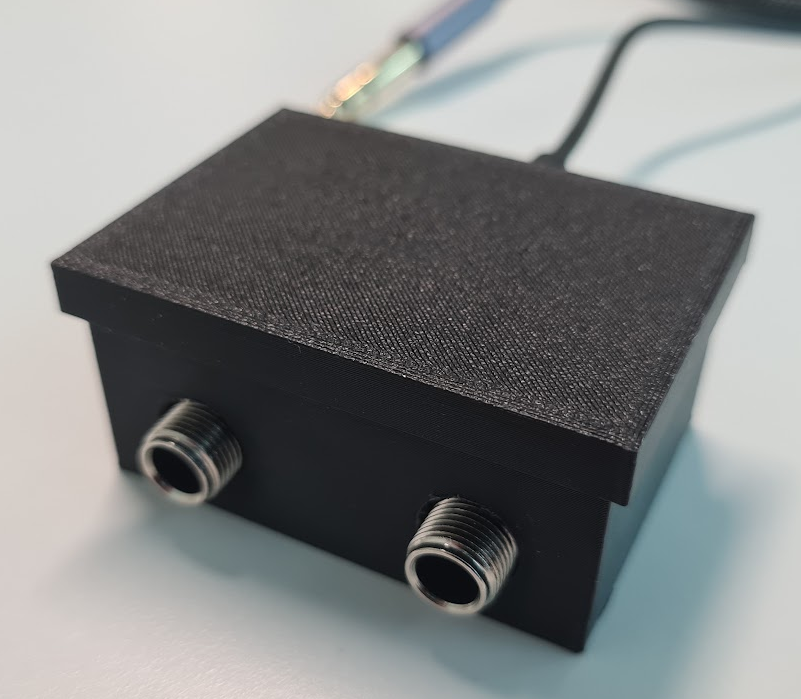

## Introduction - A bit of background about Digital Effects

### Hardware effects

Since the mid 20th century, there have been _effects_ _pedals_ available that
allow musicians (most commonly guitarists) to modify their sound. Initially
these would be made out of a few simple analogue components. Analogue effects
remain popular, but it's increasingly common for effects units to be digital.
There are now thousands of digital effects devices, essentially _tiny_
_embedded_ _computers_ running specialised software.

### Software plugins

Meanwhile, there are thousands of _software_ _plugins_, which do much the same
things, but only run on _conventional_ _computers_. The kind of computers you
might play Call of Duty or do your accounts on.

### Unifying hardware effects and software plugins

So, is there a good reason for this schism? I'd argue that in this day and age,
kinda not really. These days we have "tiny embedded computers" (aka.
"microcontrollers") that are powerful enough to run most software plugins. But
there's some effort required to make it actually work, which nobody seems to
have done until now.

## Patchula

Patchula is my user-friendly solution for running modular, user-configurable
audio plugins on cheap, embedded hardware. The system has essentially three
components:

### 1. Patch Editor

Patches can be created and auditioned on your computer using the Patch Editor.
When you're happy with the way your patch sounds, you can write the patch to the
hardware unit.

A patch could be as simple as a single plugin...

...or a chain of plugins...

...or a piano plugin that you play with your guitar...

...or a modular guitar synth.

The plugin ecosystem has many, many plugins available - basically every
"standard" thing you can think of (distortions, choruses, reverbs, phasers,
flangers...) as well as more fun stuff like autotuners, arpeggiators, granular
delays etc. There's a huge world of possibilities beyond what you'd find in a
regular multieffects unit.

### 2. Hardware

Once you've designed your sound using the Patch Editor, you can transfer it to
the hardware unit. You can do complex sound design on your home computer, and
transfer the resulting patch to a small device that's more practical for gigs,
rehearsals etc.

I have a hardware prototype, a tiny box based on an open-source design, using
common and inexpensive components. Think of this like a guitar pedal, although
it's not currently shaped like one. It has stereo audio in and out, and a USB
port for power and for programming and debugging the device. I'd love to
collaborate with someone who has more hardware design experience, or find
funding to bring someone on board.

### 3. Firmware

This is where the technologically interesting part lives. I have firmware
running on the device that can run audio plugins - more specifically, it runs
patches created in the Patch Editor, which are combinations of audio plugins.

## Product

### Initial release

I envision the first version as a deliberately minimal product: essentially the
current prototype, with Bluetooth added for control, housed in a tiny, cute,
utilitarian PC/ABS box.

JLCPCB quotes about £20 per unit to manufacture and assemble the current PCB, in
a run of 50. With higher production volumes, I think we could target a retail
price of £50-100, including case, packaging, certification, distribution and
other costs. I could do with some help firming up these costs.

At this price I believe it has potential to be a viral hit, as there's really
nothing else offering similar features, ease of use and affordability.

### Future versions

If the first version is a success, there are various directions we could take
future models.

- A similarly minimal device, but with MIDI in instead of audio in (for
  synthesizer applications)
- Various enhancement options:
  - MIDI in / out
  - Internal battery (USB rechargeable?)
  - Aluminium case
  - Footswitches and knobs
  - (Touch)screen

## What else is out there?

I want to acknowledge that this is not entirely fresh territory. There are
already some highly flexible effects units out there. However these fall into
two categories:

### 1. Luxurious reskinned computers

For example, the MOD Audio Dwarf, the Zynthian, or the Darkglass Anagram.
Underneath their musician-friendly exteriors, these are essentially
general-purpose computers - the sort of machines you could use to play Minecraft
or do your taxes.

The Dwarf is priced at €419, a usable Zynthian bundle is €520, the Anagram is
£999 at Andertons.

It's a bit unfair to compare these with the proposed £50-100 Patchula. They're
luxurious devices with much more powerful, higher-end hardware. But as far as I
know they're the only things that offer similar flexibility and usability.

While these devices win on features, capability and build quality, there are
advantages to the Patchula's simpler design. The simpler architecture means
fewer opportunities for audio glitches or crashes, and it's "instant-on", ie.
there's almost no wait between powering the device and being able to use it.

### 2. Products for engineers

For example, the Rebel Technology Owl allows users to create patches using Pure
Data and write them to the pedal. However it's more like a development
environment than a tool for musicians. I think it's fair to say its main appeal
is to highly technical users, rather than regular musicians. At €249 it's also
significantly above our target price.

There's also the Daisy Seed, an "embedded platform for audio applications". At
£30, the price and specifications are excellent. But it's a development board,
not a ready-to-use product. Users need to build hardware around it and write
software specifically for it.

### Patchula market fit

So, there are already expensive, powerful, luxury units for musicians, and there
are already platforms for technical users. What's missing is a basic,
inexpensive, musician-friendly option. The initial "basic" iteration won't be
able to do everything the high-end units can do, but we can do a lot of cool
stuff at a fraction of the price. And we can make it easier to use than the
"engineer-friendly" options.

## Caveats

I should share some limitations, in case anybody gets overexcited.

- Plugins need to be written for a particular plugin standard. There's a
  significant ecosystem and community already, although it's not as mainstream
  as VST, AU etc.
- Plugins will need to be rebuilt to run on the device's processor. In many
  cases this just requires recompilation of the source code with suitable
  compiler configuration.
- In some cases, plugins may need some optimisation or modification
- At least for the "basic" iteration, there are some significant limitations
  regarding processing speed and RAM requirements

## Some additional thoughts

This write-up is probably a bit heavy on theory and light on audiovisual
excitement. I'll try to put together a video demo soon. But I think the broader
idea _is_ quite interesting, beyond the specifics of our software. There seems
to be a yawning gap in the market for a generic, inexpensive, mass-produced
audio device that can be programmed either by end-users (at a high level) or
product developers (perhaps at a lower level). Such a device would open up
worlds of custom audio design to musicians without strong technical backgrounds
or deep pockets, and also provide software plugin developers with a route to
easily port their work to hardware.

